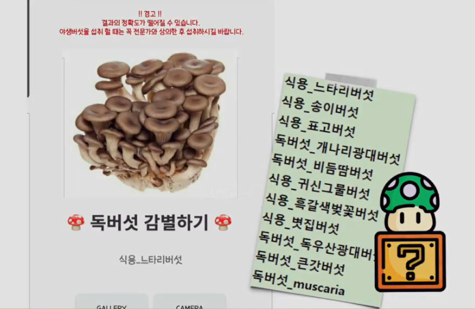
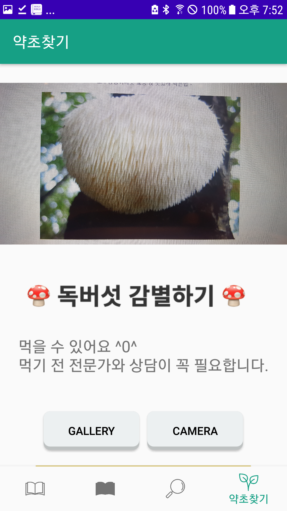
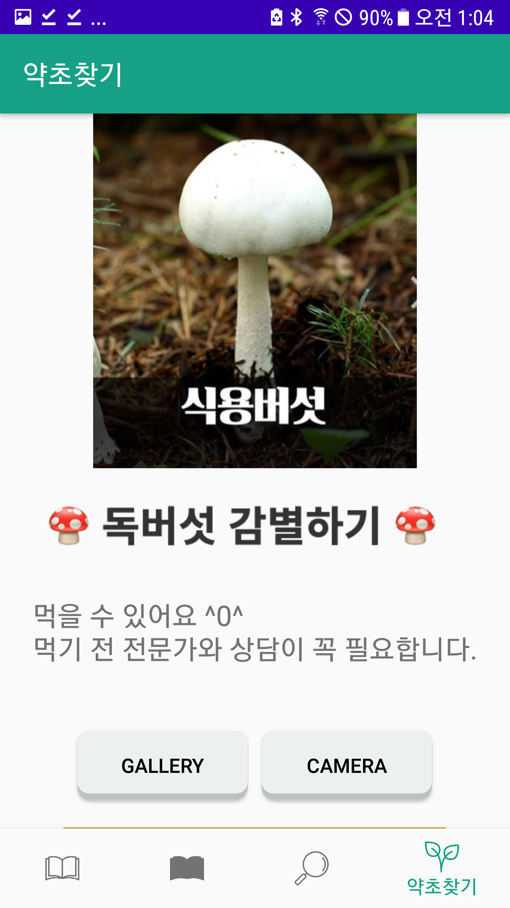

# Mushroom Classification
10 mushroom to 58 mushroom Classification

58가지 버섯 클래시피케이션

	
	
	

"notmushroom",   
"독버섯_muscaria",  
"독버섯_갈색고리갓버섯",  
"독버섯_갈황색미치광이버섯O",  
"독버섯_개나리광대버섯",  
"독버섯_검은망그물버섯",  
"독버섯_긴골광대버섯아재비",  
"독버섯_깔때기무당버섯",   
"독버섯_냄새무당버섯",  
"독버섯_노란각시버섯", 
"독버섯_노란다발버섯",   
"독버섯_노란싸리버섯",  
"독버섯_독우산광대버섯",   
"독버섯_마귀광대버섯",  
"독버섯_뱀껍질광대버섯",   
"독버섯_붉은꼭지버섯",  
"독버섯_붉은사슴뿔버섯",  
"독버섯_붉은싸리버섯",  
"독버섯_비듬땀버섯",  
"독버섯_큰갓버섯",  
"독버섯_화경버섯",  
"독버섯_흰독큰갓버섯",  
"독버섯_흰알광대버섯",  
"독버섯_흰오뚜기광대버섯",  
"식용_개암버섯",  
"식용_곰보버섯", " 
식용_굴털이젖버섯",  
"식용_귀신그물버섯",  
"식용_그물버섯아재비",  
"식용_금빛비늘버섯",  
"식용_기와버섯",  
"식용_꾀꼬리버섯",  
"식용_노루궁뎅이",  
"식용_느타리버섯",  
"식용_능이버섯",  
"식용_다발방패버섯",  
"식용_다색벚꽃버섯",  
"식용_달걀버섯",  
"식용_먹물버섯",  
"식용_볏집버섯",  
"식용_뿔나팔버섯",  
"식용_새잣버섯",  
"식용_송이버섯",  
"식용_싸리버섯",  
"식용_연기색만가닥버섯",  
"식용_영지버섯",  
"식용_잎새버섯",   
"식용_자주방망이버섯아재비",   
"식용_점마개버섯",   
"식용_팽나무버섯",   
"식용_팽이버섯",   
"식용_표고버섯",   
"식용_하늘색깔대기버섯",   
"식용_흑갈색벚꽃버섯",   
"식용_흰주름버섯"  